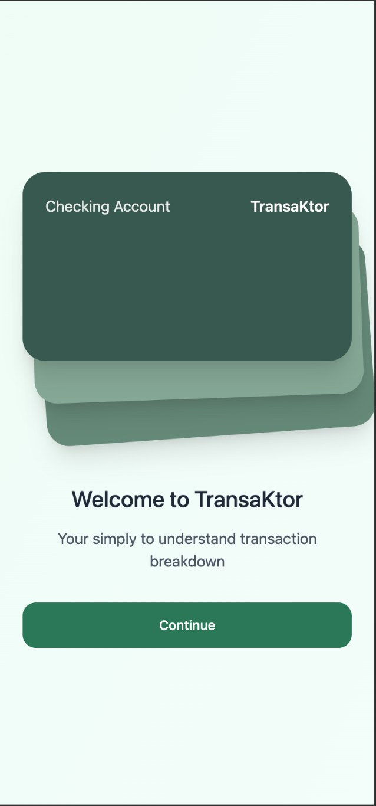
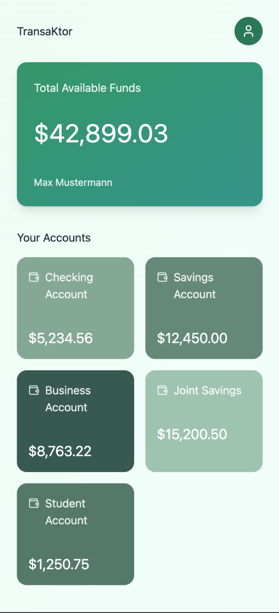
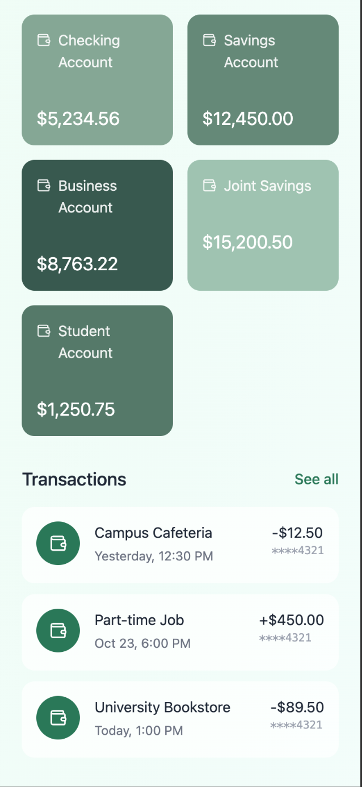
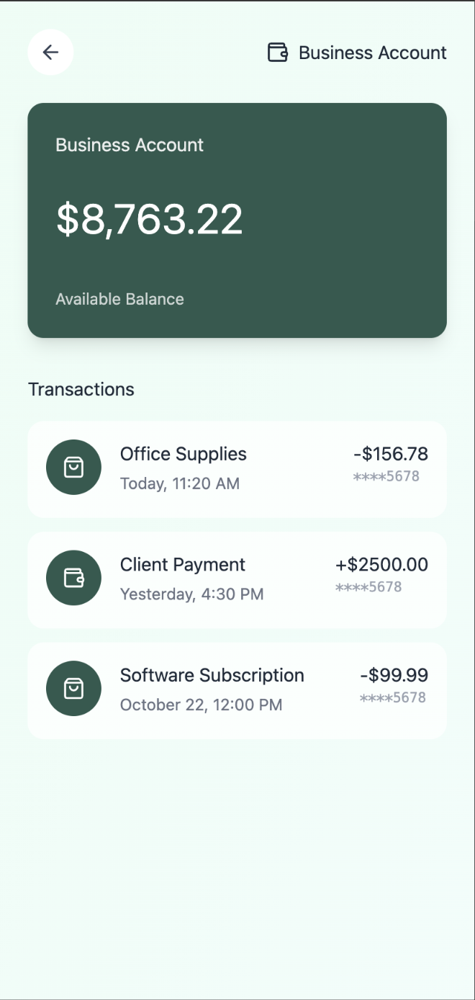

# TransaKtor

A demo banking project that emerged from a 12-hour hackathon breaking down accounts into
transactions,
showcasing a basic Kotlin Multiplatform project with Compose Multiplatform, Ktor, Coroutines, and
Koin.

Please note that, due to the time limit and budget of the hackathon, some features are not available
and will not be added at a later date. This project serves to preserve the state of the 12-hour
hackathon.

## Project Structure

This is a Kotlin Multiplatform project targeting Android and iOS while sharing the UI by using
Compose Multiplatform.

### Build and Run Android Application

You should be able to run the Android app of this KMP project like any other Android app.
Open the project in Android Studio and use the run configuration from the run widget
in your IDE’s toolbar or build it directly from the terminal:

```shell
  ./gradlew :composeApp:assembleDebug
```

### Build and Run iOS Application

To build and run the iOS app you need a functioning KMP development environment, see
[Kotlin Multiplatform](https://www.jetbrains.com/help/kotlin-multiplatform-dev/get-started.html).
Either, use the run configuration from the run widget in Android Studio or open the
[/iosApp](./iosApp) directory in Xcode and run it from there.

### Running Tests

You can run the tests of this project via the "Execute Gradle Task" Button in Android Studio or
directly from the terminal:

```shell
  ./gradlew :composeApp:allTests
```

Note that, currently the test coverage is not very high and that some tests fail. As this project is
a proof of concept, which was developed in a tight timeframe, not all features are fully
implemented.
Those features may fail the test, though, I wanted to have the test cases for the final
to-be-desired state in place.

## Initial Mockup

The initial goal was to fully utilize the available data of the API. It contains a list of accounts
and list of transactions.
A simple main-detail navigation utilizing a dashboard and a detail screens for accounts and
transactions should do the trick to help the users understand their banking portfolio.

I created a mockup of the app using Figma to get an idea of what I wanted to achieve.



## Demonstration


